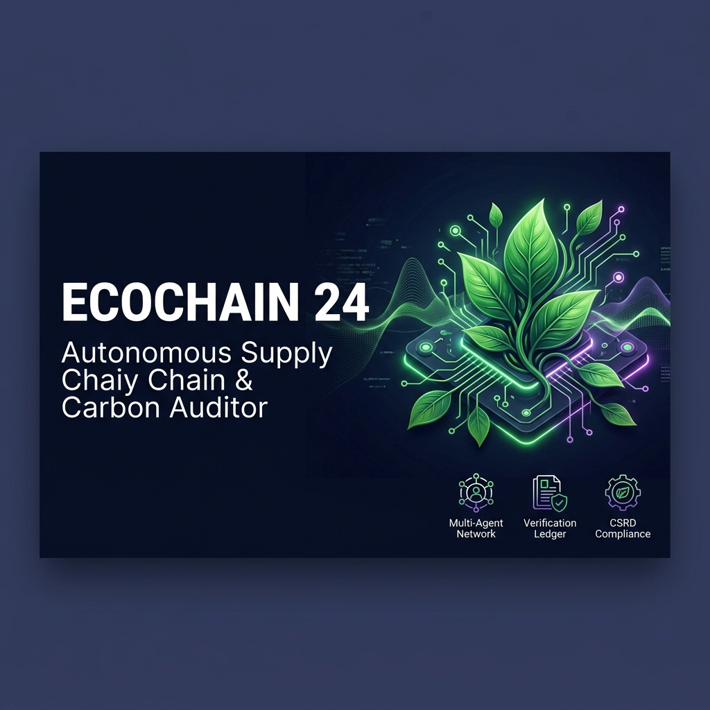
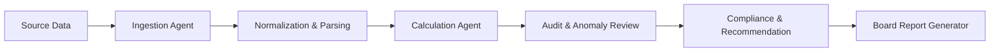
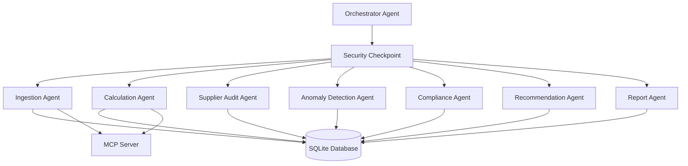
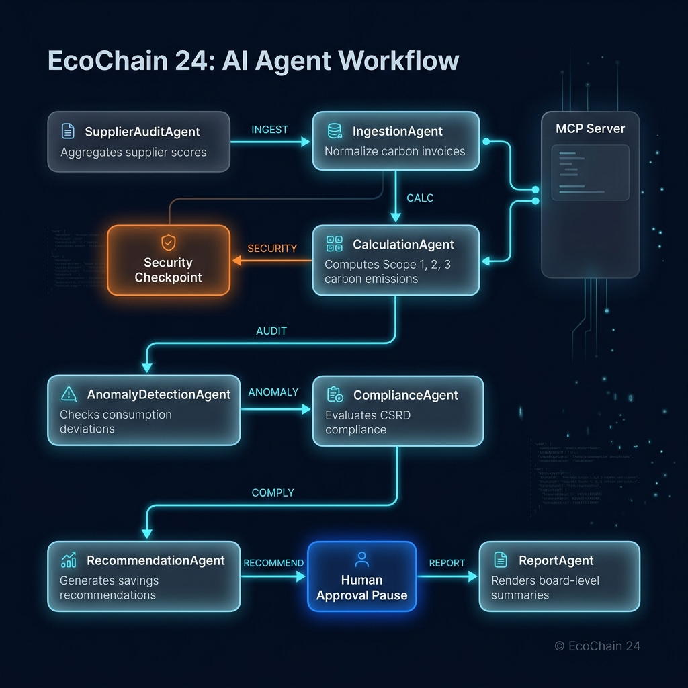

# EcoChain 24 — Autonomous Multi-Agent Carbon Intelligence



EcoChain 24 is an autonomous hierarchical multi-agent auditing system for Scope 1, 2, and 3 carbon emissions tracking with cryptographic audit-trail integrity. It transforms fragmented supplier, utility, and invoice data into auditable carbon disclosures that support board-level reporting, compliance review, and anomaly resolution.

## Why EcoChain 24 matters

- Automates the ingestion of emissions-related records from invoices, ERP exports, and utility data.
- Uses specialist agents to normalize, calculate, audit, and report carbon outcomes.
- Preserves a tamper-resistant audit trail through chained cryptographic hashes.
- Supports Human-in-the-Loop review for low-confidence or anomalous records.

## Prerequisites

- Python 3.11 or newer
- uv for dependency management
- A Gemini API key from Google AI Studio
- Git for version control and GitHub publishing

## Quick start

1. Clone the repository:
   ```bash
   git clone https://github.com/<your-username>/EcoChain24.git
   cd EcoChain24
   ```

2. Create a local environment file:
   ```env
   GOOGLE_API_KEY=your_gemini_api_key_here
   GOOGLE_GENAI_USE_VERTEXAI=False
   GEMINI_MODEL=gemini-3.5-flash
   ```

3. Install Python dependencies:
   ```bash
   make install
   ```

4. Run the demo workflow:
   ```bash
   python run_demo.py
   ```

5. Launch the interactive playground:
   ```bash
   make playground
   ```
   The UI will open at http://localhost:18081.

## Workflow diagram



## Solution architecture





## Core components

- Orchestrator agent: coordinates the full workflow and routes records between specialist agents.
- Ingestion agent: normalizes supplier and activity data and flags low-confidence parses.
- Calculation agent: applies emissions factors for Scope 1, 2, and 3 scenarios.
- Audit and anomaly agents: detect conflicts, outliers, and operational irregularities.
- Compliance and recommendation agents: prepare risk notices and action guidance.
- Report agent: produces board-ready reporting outputs and evidence summaries.

## Security and MCP design

- Security checkpoint: scrubs PII, detects prompt injection attempts, and writes structured audit events.
- MCP server: exposes tools for factor lookup, document parsing, normalization, and audit logging.
- Human-in-the-Loop review: low-confidence or high-risk records are paused for review before final reporting.

## How to run

- Start the playground UI:
  ```bash
  make playground
  ```
- Start the local server:
  ```bash
  make run
  ```
- Run the automated tests:
  ```bash
  make test
  ```

## Sample test cases

### Case 1: Ingestion of Scope 1 diesel fuel
- Input:
  ```json
  {
    "supplier_id": "sup_alpha_logistics",
    "period": "2024-Q1",
    "activity_type": "fuel",
    "quantity": 1200.0,
    "unit": "L",
    "country": "US",
    "details": {"fuel_type": "diesel"}
  }
  ```
- Expected behavior: the orchestrator routes the record through ingestion and calculation, then stores a Scope 1 emission result in the database.
- Check: the audit log shows calculation events and the report contains the new emissions record.

### Case 2: Supplier Tier D conflict mitigation
- Input: a record from a supplier flagged as low trust or Tier D with a conflicting verification status.
- Expected behavior: the workflow pauses for review, downgrades confidence, routes the case to compliance, and raises an alert.
- Check: the anomaly and compliance pathways are triggered and the record remains quarantined until reviewed.

### Case 3: Scope 2 renewable electricity evaluation
- Input:
  ```json
  {
    "supplier_id": "sup_green_energy",
    "period": "2024-Q1",
    "activity_type": "electricity",
    "quantity": 5500.0,
    "unit": "kWh",
    "details": {"tariff_type": "renewable"}
  }
  ```
- Expected behavior: the calculation agent applies dual Scope 2 reporting logic and produces a market-based result of zero for renewable EAC coverage.
- Check: the generated report reflects the correct location-based and market-based values.

## Troubleshooting

1. Gemini API 404 or quota errors
   - Cause: stale model selection or exceeded free-tier limits.
   - Fix: set `GEMINI_MODEL` to a live value such as `gemini-3.5-flash` or `gemini-3.5-flash-lite`.

2. Duplicate records after repeated runs
   - Cause: repeated ingestion with path normalization issues.
   - Fix: rerun `python run_demo.py` to reset the demo database.

3. Port conflicts on 18081 or 8090
   - Cause: a previous playground or server process is still running.
   - Fix: stop the existing process and restart the app.

## Project structure

- [ecochain/](ecochain/) contains the multi-agent implementation and supporting services.
- [tests/](tests/) contains validation and integration tests.
- [reports/](reports/) contains generated report outputs.
- [dashboard/](dashboard/) contains a lightweight local dashboard view.
- [assets/](assets/) contains the cover banner and architecture diagram.

## Assets

- Cover page banner: [assets/cover_page_banner.png](assets/cover_page_banner.png)
- Solution architecture diagram: [assets/architecture_diagram.png](assets/architecture_diagram.png)
- Demo narration: [DEMO_SCRIPT.txt](DEMO_SCRIPT.txt)
- Submission write-up: [SUBMISSION_WRITEUP.md](SUBMISSION_WRITEUP.md)

## Push to GitHub

```bash
git init
git add .
git commit -m "Initial commit: EcoChain 24"
git branch -M main
git remote add origin https://github.com/<your-username>/EcoChain24.git
git push -u origin main
```

> Never commit your `.env` file. Keep secrets out of GitHub.

## Demo Script

The spoken presentation narration script is available at [DEMO_SCRIPT.txt](DEMO_SCRIPT.txt).

Use it during the live walkthrough to cover:
- the problem statement and target audience
- the agent workflow and architecture
- the three sample test cases
- the security, MCP, and governance story
- the closing impact and next-step discussion
